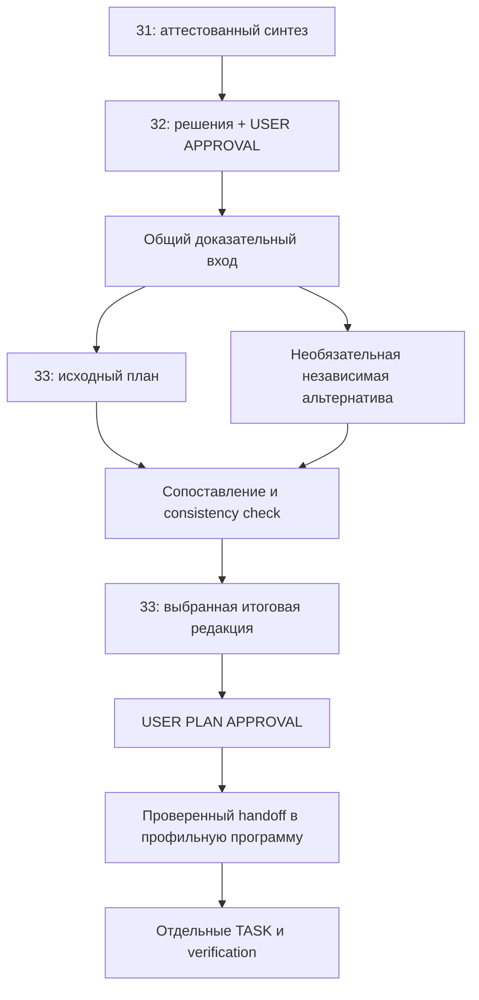

# Архитектура круглого стола — предложение от Astra

**Статус:** PROPOSAL / для обсуждения; предложения не утверждены.
**Дата:** 10 октября 2026 года.
**Автор предложения:** Astra — обозначение автора экспертного заключения в текущем чате.
**Назначение:** временный документ с независимой экспертизой архитектуры Round Table, реконструкцией RT-002 и предложениями по развитию протокола.
**Связь:** [[28_Круглый стол - протокол и текущий вопрос|28 — протокол и текущий вопрос]].

Документ создан и присоединён к узлу 28 по прямому поручению пользователя. Это отдельный экспертный материал, а не новая стадия Round Table, вклад участника RT-002, утверждённая архитектура или разрешение на реализацию. Решения и полномочия сохраняются у владельцев 28/31/32/33. Дальнейшую судьбу временного материала определит пользователь после обсуждения.

Ниже сохранён полный итоговый анализ из чата, разделы A–L. Формулировка «ничего не изменено» описывает завершённый этап read-only экспертизы; сохранение этого документа и добавление связи выполнены позднее, по отдельному поручению. Выводы и статусы в анализе относятся к зафиксированному там снимку источников, а не обновляются автоматически. Номера строк также относятся к моменту анализа.

Оформление локальных ссылок адаптировано: сохранены подписи, пути и номера строк, но они записаны текстовыми адресами, чтобы не создавать дополнительные связи Obsidian. Внешние ссылки сохранены. Единственная связь этого документа с другими заметками — 28 ↔ 28.1.

---

**Основной вывод: существующий Round Table в целом построен правильно. RT-002 демонстрирует работающий механизм обнаружения и исправления ошибок. Оснований заменять его новой системой документов нет.**

Практическая проблема — согласованность статусов, воспроизводимость источников и точный контракт передачи доказательств планировщику. Рекомендую исправить эти места, сохранить аттестованный 31 и утверждённые решения 32, дополнить правила 33. Отдельный 32.1 и обязательная цепочка из трёх планов сейчас не обоснованы.

Ниже — независимое заключение и проект изменений. **Ничего не изменено, новые документы и агенты не создавались, Ultra и платные проверки не запускались.**

## A. AS-IS — независимая оценка существующего Round Table

### Проверенная база и текущее состояние

Исследованы правила 08/000/18/34, весь содержательный контур RT-002, относящиеся к нему разделы 01/11/13/20/21, адресные участки кода и тестов. Ключевые измерения перепроверены чтением сохранённых JSON/JSONL, без воспроизведения RUN.

Локальная рабочая копия находится на `7f63525c1f67affa76c6b0cba73a21b09aa103ee`. GitHub доступен; проверенный удалённый `main` — `0297403c3e3a1f0576a29f037a25f9a8544a2614`. Дополнительный коммит меняет только правила координации в 08/18/34; документы RT-002 и runtime он не меняет. Эти уточнения учтены. Существующие локальные изменения в `.obsidian` и 34 оставлены без вмешательства.

Установлено:

| Объект | Фактическое состояние |
|---|---|
| R1/R2 | Вклады сохранены; предварительная печать до раскрытия независимо не подтверждена |
| Синтез 31 | Текущие байты совпадают с последними личными PASS обоих участников |
| Representation gate | Закрыт координатором в 28 для той же версии |
| Вердикт 32 | В сохранённом Decision Record записан USER APPROVAL от 10.10.2026 |
| План 33 | Полный DRAFT T0–T13; PLAN APPROVAL отсутствует |
| Передача в 20/21 | Ещё не разрешена |
| 32.1/33.1/33.2/33.3 | Файлы отсутствуют |

Полный SHA-256 аттестованного 31:

```text
34f8706348dad6b42e22ad3ca20515b48a3f633ad2eefb85e5e33a809223bf76
```

Он подтверждён моим вычислением, последним PASS Claude (`Документация/31.1_Круглый стол - проверка синтеза Claude.md:220`), последним PASS Codex (`Документация/31.2_Круглый стол - проверка синтеза Codex.md:142`) и записью закрытия gate (`Документация/28_Круглый стол - протокол и текущий вопрос.md:313`).

Источник подтверждения пользовательского решения в этой экспертизе — сохранённый Decision Record (`Документация/32_Круглый стол - вердикт и реестр решений.md:162`). Исходное сообщение человека отдельно не проверялось.

### Что архитектурно удачно

Стадии решают разные задачи:

| Стадия | Добавляемая ценность |
|---|---|
| Постановка и snapshot | Общая задача, границы и исходные условия |
| R1 | Самостоятельный поиск объяснений и дефектов |
| R2 | Проверка конкретных чужих утверждений и собственных ошибок |
| Синтез | Сведение доказательств, исправлений и разногласий |
| Representation check | Проверка точности передачи позиций |
| Вердикт | Превращение исследования в отдельные решения человека |
| План | Зависимости, задачи, проверки и способ реализации |
| Handoff | Передача ответственности профильной программе |

**R2 и representation check не являются дублированием.** RT-002 показывает, что после технической перекрёстной проверки синтезатор ещё может ошибиться в причинности, авторстве, количестве передач или содержании позиции участника.

Особенно удачно разделены:

- техническое согласие и доказательство;
- корректность представления позиции и истинность вывода;
- утверждение решения и утверждение плана;
- планирование и разрешение исполнения;
- временный Round Table и профильная документация реализации.

Это уже закреплено в lifecycle и representation-протоколе 28 (`Документация/28_Круглый стол - протокол и текущий вопрос.md:61`) и границах документа 33 (`Документация/33_Круглый стол - план исполнения.md:15`).

### Реальные гарантии и их пределы

| Механизм | Что обеспечивает | Чего не обеспечивает |
|---|---|---|
| SHA-256 | Проверяемую идентичность содержания | Истинность, полноту, авторство |
| Личный PASS | Аттестацию участником представления его позиции | Повторную независимую проверку всех технических фактов |
| Git-версия | Восстановление сохранённого текста | Доказательство, что участник прежде не видел чужую работу |
| R1/R2 | Возможность обнаружить ошибки и альтернативы | Статистическую независимость моделей и отсутствие общих заблуждений |
| USER APPROVAL | Зафиксированное человеческое решение | Автоматическое разрешение любой реализации |
| PLAN APPROVAL | Принятие конкретного плана | Разрешение самовольно расширять TASK |

В нынешнем ручном процессе ограничения чтения, назначения ролей, сдачи и переходов преимущественно **организационные**. Доступ к общей папке технически не запрещает прочитать чужой вклад.

Даже предварительный коммит доказывает наличие текста в определённой версии, но сам по себе не доказывает отсутствие более раннего доступа к чужим материалам. Формулировка 28 о печати раунда (`Документация/28_Круглый стол - протокол и текущий вопрос.md:99`) несколько сильнее реальной гарантии.

### Доказанные недостатки

**1. Статусы расходятся между документами.**

- 32:108 (`Документация/32_Круглый стол - вердикт и реестр решений.md:108`) говорит «ни один пункт не утверждён», хотя ниже находится утверждённый Decision Record.
- 35:13 (`Документация/35_Круглый стол - краткая история.md:13`) сообщает, что R1 ещё не начинался.
- Статус ожидания проверки внутри 31 тоже устарел, **но здесь причина другая**: файл намеренно заморожен, а актуальное закрытие вынесено в 28.

Следовательно, нельзя исправлять все три случая одинаковым редактированием.

**2. Строго одинаковый исходный snapshot RT-002 не доказан.**

Codex получил дополнительное уточнение пользователя и более поздние R-034/R-035. Оба участника знали исторический диагноз из 21. Эти обстоятельства раскрыты, что хорошо, но полноценной слепой репликацией одинакового исследования RT-002 считать нельзя. См. аттестацию Codex (`Документация/30_Круглый стол - независимый анализ Codex.md:243`) и разбор независимости Claude (`Документация/29.1_Круглый стол - перекрёстная оценка Claude.md:190`).

**3. Есть конфликт между неизменностью 31 и записью его окончательного статуса.**

28:105–109 (`Документация/28_Круглый стол - протокол и текущий вопрос.md:103`) требует фиксировать версию и gate в 31, одновременно считая любое изменение файла новой версией. Запись закрытия после получения PASS изменяет аттестованные байты. Собственный полный хеш также нельзя практически хранить внутри тех же хешируемых байтов.

Фактическое закрытие через 28 разумно; постоянный регламент должен однозначно соответствовать этой практике.

**4. Условия очистки изложены неравномерно.**

Общее правило 28 требует handoff, архива, резервирования и разрешения пользователя. Локальные инструкции некоторых документов кратко связывают очистку только с Decision Record. Например, 29:54 (`Документация/29_Круглый стол - независимый анализ Claude.md:54`). Это опасное сокращение для агента, читающего один файл.

**5. Доказательные входы планировщика закреплены слабее, чем его полномочия.**

33 требует approved verdict, актуальный код, архитектуру и тесты, но не закрепляет столь же явно обязательное получение исправлений, unresolved и причинных ограничений из 31. Этот пробел частично закрывает 34, однако изменяемый тактический документ не должен быть единственным владельцем постоянного правила.

**6. Git сохраняет не всю доказательную базу.**

Все три проверявшиеся версии 31 найдены в Git с совпадающими SHA-256. Однако исследованные `.ultra/audit` raw-файлы не отслеживаются Git. Архивирование Markdown не гарантирует сохранность первичных RUN evidence.

### Классификация

| Категория | Заключение |
|---|---|
| `KEEP AS IS` | Основной lifecycle, независимые раунды, личные PASS, раздельные approvals, профильный handoff |
| `CLARIFY` | Владение текущим статусом, хеширование, очистка, пределы доказательства независимости |
| `IMPROVE` | Snapshot, адресация источников, доказательные входы планирования, сохранность raw evidence |
| `REDESIGN` | Оснований для перестройки всего Round Table не установлено |
| `DEFER` | Серверная изоляция, автоматическая оркестрация, общий реестр claims |

Риски ложного согласия, бесконечных итераций и чрезмерной стоимости реальны как архитектурные возможности. **Их частота и экономический ущерб данным исследованием не измерены.**

## B. Реконструкция RT-002

### A. R-026: одна UNKNOWN-попытка и два terminal events

Цепочка восстанавливается без дополнительного документа:

1. **Первоначальная позиция Claude:** две UNKNOWN-попытки; широкое утверждение об отсутствии дубликатов. 29:111 (`Документация/29_Круглый стол - независимый анализ Claude.md:111`).
2. **Возражение Codex в R2:** 18 terminal records относятся к 17 уникальным attempt ID; timeout и recovery имеют один ID. Также найдено расхождение stream/summary. 30.1:94 (`Документация/30.1_Круглый стол - перекрёстная оценка Codex.md:94`).
3. **Новая проверка Claude:** при representation check он прочитал raw-записи и признал первоначальную ошибку. Исправление записано как SC-1, без переписывания R1. 31.1:128 (`Документация/31.1_Круглый стол - проверка синтеза Claude.md:128`).
4. **Синтез:** число попыток разрешено; происхождение дубликата и актуальность дефекта оставлены открытыми. 31:273 (`Документация/31_Круглый стол - синтез и разногласия.md:273`).
5. **Проверка синтеза:** оба участника подтвердили окончательную версию; это подтверждает передачу поправки, а не установленную причину recovery-аномалии.
6. **Решение:** V-7 требует честного accounting и проверки raw stream → summary.

Моя перепроверка raw executor stream (`.ultra/audit/chat_b36a4eba7fdf47f98b1d71507bc2938d/20260930_233733_1f2fee/executor.jsonl:59`) подтвердила два события одного `provider_attempt_id`:

```text
timeout → aborted_external_recovery
```

У обоих usage отсутствует. Это **одна попытка с неизвестным расходом**, а не две попытки и не доказанное двойное списание.

**Дополнительное уточнение экспертизы:** сочетание `provider_accounting.complete=true` и `usage.complete=false` само по себе допустимо. Первый признак отражает полноту завершения попыток, второй — известность usage. Именно такую комбинацию предусматривает существующий тест UNKNOWN (`test_usage_accounting.py:76`).

Доказанная несогласованность — **наличие повторного terminal в stream при пустом `duplicate_terminal_ids` в summary**. Текущий агрегатор (`run_store.py:480`) и тест дубликата (`test_usage_accounting.py:138`) предусматривают обнаружение такого повтора. Почему историческая запись прошла иначе, не установлено.

**Для планирования:** сохранять identity попытки, различать полноту событий и полноту usage, проверять recovery-путь. Нельзя заменять это задачей «свести все complete-флаги к одному» или «исправить доказанное двойное списание».

### B. R-033/R-034: измерение размера не доказывает его причину

1. **Claude R1** связал дорогой DIRECT Final Audit с workspace-wide diff. 29:229 (`Документация/29_Круглый стол - независимый анализ Claude.md:229`).
2. **Codex R1** зафиксировал изменение размера пакета, оставив причину неизвестной. 30:159 (`Документация/30_Круглый стол - независимый анализ Codex.md:159`).
3. В независимых R2 Claude развил гипотезу через состояние дерева, время изменений и размеры; Codex указал, что состав старого пакета непосредственно не доказан. Это параллельные проверки R1, а не чтение участниками чужого R2. Claude N-1 (`Документация/29.1_Круглый стол - перекрёстная оценка Claude.md:163`), Codex (`Документация/30.1_Круглый стол - перекрёстная оценка Codex.md:96`).
4. **Representation check** потребовал отдельно сохранить факты состояния дерева и гипотезу причинности. Дополнительно синтез ограничил силу mtime: одинаковое время изменения не доказывает тождество всех загруженных байтов и условий.
5. **Итог:** причина остаётся UNRESOLVED. 31:245 (`Документация/31_Круглый стол - синтез и разногласия.md:245`).
6. **V-8 утверждает исследование**, а не удаление обязательного Git evidence.

Моё чтение сохранённых `provider_attempt_started` подтвердило:

| RUN | Размер HTTP request Dredd | Provider-reported total Dredd |
|---|---:|---:|
| R-033 | 80 382 байта | 17 424 |
| R-034 | 7 670 байт | 1 805 |

Источники: R-033 (`.ultra/audit/chat_b36a4eba7fdf47f98b1d71507bc2938d/20261009_211440_30b40f/dredd.jsonl:2`), R-034 (`.ultra/audit/chat_b36a4eba7fdf47f98b1d71507bc2938d/20261009_223343_3f4fef/dredd.jsonl:2`).

**Для планирования:** нужен контролируемый offline-сценарий dirty/clean с проверкой состава пакета. Формулировка «убрать diff, поскольку он доказанно виноват» превышает доказательства и утверждённые полномочия.

### C. R-031: причина расхода и границы причинных выводов

Первоначальные анализы согласились по механизму накопления tool results, но различались по единицам, формулировкам роли Planner и трактовке cached.

Далее:

- Claude подтвердил вычисления Codex о 11 передачах и снял часть прежних объяснений.
- Codex уточнил семантику cached и указал ошибки исходного описания путей.
- Representation check восстановил существенные оговорки: **11 передач суммарно**, а не 11 дополнительных; стадия с `equals` не исполнялась; гипотезу косвенного влияния Planner через READINESS в R-027 первоначально предложил Claude.
- Окончательный синтез сохранил измеренный основной механизм и отдельно — возможные усилители. 31 C-1 (`Документация/31_Круглый стол - синтез и разногласия.md:136`), 31 D-1 (`Документация/31_Круглый стол - синтез и разногласия.md:237`), замечания Codex F-3/F-4 (`Документация/31.2_Круглый стол - проверка синтеза Codex.md:103`).

По raw-записям я независимо пересчитал:

| Метрика | Значение |
|---|---:|
| Provider calls | 16: Planner 1, Executor 15, Dredd 0 |
| Provider-reported total | 668 898 |
| Prompt | 667 321 |
| Completion | 1 577 |
| Precached prompt | 179 456 |
| Processed input | 846 777 |
| Передачи двух больших function messages | 8 + 3 = 11 |
| Суммарный объём этих сообщений | 3 072 575 сериализованных символов |

Оба чтения вернули одинаковый `content_sha256`; каждое содержало 238 540 символов файла. Источники — первое чтение (`.ultra/audit/chat_b36a4eba7fdf47f98b1d71507bc2938d/20261001_182057_e90f93/server.jsonl:34`), второе (`.ultra/audit/chat_b36a4eba7fdf47f98b1d71507bc2938d/20261001_182057_e90f93/server.jsonl:54`), Executor stream (`.ultra/audit/chat_b36a4eba7fdf47f98b1d71507bc2938d/20261001_182057_e90f93/executor.jsonl:1`).

Разделение cached и provider total соответствует доступной официальной документации GigaChat. Это не проверка конкретного денежного счёта пользователя. [Документация подсчёта токенов](https://developers.sber.ru/docs/ru/gigachat/guides/counting-tokens).

**Обязательные входы планировщика:**

- проблема возникает внутри одной стадии, поэтому одного stage reset недостаточно;
- 151C не устраняет этот механизм: Dredd в R-031 вообще не вызывался;
- ограничение отдельного чтения и общего запроса решают разные задачи;
- малые собственные расходы Planner не исключают косвенного влияния плана;
- исправление `equals` полезно для корректности, но его экономия на R-031 не доказана;
- проценты символов нельзя выдавать за долю денежного счёта.

Подробную последовательность всех 15 запросов можно оставить в адресном evidence.

### D. DIRECT: полезность повторной проверки синтеза

1. Claude R1 указал отсутствие сброса Executor context в DIRECT. 29 D-4 (`Документация/29_Круглый стол - независимый анализ Claude.md:246`).
2. В первой версии синтеза этот факт был недостаточно отражён; Claude отметил пропуск R-8.
3. Исправленная версия сформулировала отсутствие сброса «между стадиями».
4. Claude указал новую неточность: **в DIRECT нет соответствующего lifecycle и стадий**. 31.1:210 (`Документация/31.1_Круглый стол - проверка синтеза Claude.md:210`).
5. Следующая версия исправила формулировку; оба участника лично подтвердили новые байты.

Текущий код server.py:4314 (`server.py:4314`) действительно немедленно выходит из `stage_context`, если lifecycle отсутствует.

В Git сохранены все три проверявшиеся редакции:

| Редакция | SHA-256, сокращённо | Коммит |
|---|---|---|
| Исходная | `1de5033e…` | `ddb6f3a8fbe8…` |
| Первая исправленная | `3328af02…` | `861457340342…` |
| Окончательная | `34f87063…` | `efbff4dcf3cb…` |

**Для планирования:** DIRECT должен иметь собственное ограничение рабочего контекста. Тест, проверяющий только смену стадий, не покрывает этот маршрут.

Старое условное согласие Claude и PASS Codex предыдущей версии правильно не были перенесены автоматически.

### Дополнительный случай: D-9 и ложный PASS

Claude обнаружил, что R-032 вернул `{"candidates":[]}` на приветствие и получил Final Audit PASS. Codex пропустил это в R1, признал в R2. Representation check восстановил авторство находки; синтез сохранил неизвестную частоту воспроизведения. 31 C-6 (`Документация/31_Круглый стол - синтез и разногласия.md:214`).

Я подтвердил сохранённый ответ (`.ultra/audit/chat_b36a4eba7fdf47f98b1d71507bc2938d/20261009_211347_6efe8c/executor.jsonl:4`) и PASS Dredd (`.ultra/audit/chat_b36a4eba7fdf47f98b1d71507bc2938d/20261009_211347_6efe8c/dredd.jsonl:4`).

Для реализации нужен контроль соответствия ответа RAW TASK. **Общий запрет JSON был бы неверным исправлением:** пользователь может специально запросить JSON.

## C. Проблема передачи знаний

**Потеря истории в существующем комплекте не доказана.** Четыре обязательные цепочки восстановлены. Сохранены первоначальные ошибки, возражения, поправки, авторство и unresolved.

Доказана другая проблема: эти сведения распределены между источниками и не все объявлены обязательными входами планирования.

При передаче только короткого вердикта могут потеряться:

| Что необходимо сохранить | Какую ошибку планирования это предотвращает |
|---|---|
| Одна UNKNOWN-попытка, два terminal events | Неверная модель attempts и списаний |
| Разные значения двух complete-флагов | Ошибочное объединение разных признаков полноты |
| Dirty workspace — гипотеза причинности | Преждевременное удаление evidence |
| DIRECT без стадий | Защита только на stage transition |
| `equals` не исполнялся | Ложное обещание экономии от этого исправления |
| Пороговые числа не утверждены | Превращение 64k/200k в обязательные defaults |
| V-13 deferred | Самовольный запуск последующих этапов |

При этом **32 уже содержит немало ограничений и unresolved**, а 33 — verdict→TASK mapping. Поэтому идея «планировщик сейчас получает лишь голый итог» преувеличивает проблему.

Достаточный минимальный контракт:

> Каждый существенный элемент плана связан с решением пользователя, актуальным техническим основанием, ограничениями этого основания и проверкой результата.

Полную историю спора следует читать там, где она помогает проверить этот контракт.

## D. Сравнение архитектурных альтернатив

Оценки стоимости ниже относительные, не результаты LLM-бенчмарка.

| Вариант | Полнота и достоверность | Дублирование и сопровождение | Чтение, версии, Obsidian | Оценка |
|---|---|---|---|---|
| **A. 31/32/33 без новых файлов** | Источников достаточно; нужен явный маршрут | Минимум новых копий | Умеренное чтение; хорошие ручные свойства | Хорошая основа |
| **B. Расширить 31** | Можно заранее улучшить передачу оснований | Риск разрастания синтеза | Для RT-002 меняет SHA и требует новых PASS | Для будущих RT до аттестации |
| **C. Расширить 32** | Удобно соединить решение с rationale | Риск смешать authority и пересказ доказательств | Утверждённый документ нельзя свободно переписывать | Только краткие ссылки и границы |
| **D. Отдельный 32.1** | Полезен при самостоятельной большой доказательной базе | Высокий риск дублирования 31/32 и третьей версии фактов | Ещё один документ для проверки, обновления и архива | Сейчас не оправдан |
| **E. Динамический Context Pack** | Хорош при обязательном включении ограничений и отрицательных данных | Нет постоянной копии, но нужен проверяемый отбор | Экономное чтение возможно; стоимость подготовки тоже учитывается | Ручная выборка сейчас, автоматизация позже |
| **F. Реестр claims + производные представления** | Сильная трассировка при корректной модели данных | Самая высокая начальная сложность | Хорош для Ultra и N участников; избыточен для двух ручных исследований | Отложить |
| **G. A + компактный manifest в 33 + адресная выборка** | Сохраняет существующие основания и добавляет контракт использования | Небольшое управляемое дополнение | Не затрагивает SHA 31, не требует новых рёбер Graph | Рекомендую |

Отдельный 32.1 стоит пересмотреть, если появятся измеренные проблемы: множество потребителей, большой независимый корпус evidence, частые запросы по claims или невозможность удержать manifest компактным. Наличие одной идеи нового документа таким основанием не является.

## E. Рекомендуемая архитектура

### Основной lifecycle

Исследовательскую часть сохранить. Дополнить только post-round planning:



Это схема процесса, не предложение добавить соответствующие Wiki-рёбра.

**Отдельный итоговый файл 33.3 не нужен.** Документ 33 уже владеет планом, который должен пройти PLAN APPROVAL. Его исходная редакция сохраняется как версия; итоговая редакция становится выбранным кандидатом. После handoff владельцем рабочего плана становится профильная программа.

### Независимый план и рецензия — разные режимы

**Независимое планирование:**

1. Получить решения 32, необходимые основания 31, общий snapshot и ограничения.
2. Проверить актуальные код, тесты и программу.
3. Сформировать и зафиксировать собственный вариант.
4. Только затем прочитать исходный план 33.
5. Выпустить сравнительную дельту, сохранив первоначальный вариант.

**Рецензирование:**

1. Сразу прочитать 33.
2. Проверить зависимости, полноту и соответствие 32.
3. Выдать findings и предложения.

Рецензия может быть качественной, но её нельзя объявлять слепым независимым проектированием.

Если агент уже прочитал 33 или получил подробный пересказ его структуры, это следует отметить. Инструкцией нельзя отменить уже полученную информацию. Для строгой независимости нужен новый контекст с контролируемой выдачей материалов.

### Сколько планировщиков

Для RT-002 разумный следующий уровень — **один дополнительный планировщик**. Уже имеется подробный базовый план; одна самостоятельная альтернатива способна выявить ошибки его зависимостей и scope.

Второй дополнительный участник нужен при конкретном основании: нерешённом существенном конфликте, требуемой специализации или слабой проверяемости первой альтернативы. Три похожих плана сами по себе не повышают качество.

### Сопоставление планов

Сравнивать следует по одинаковым критериям:

- соответствие V-1…V-13;
- безопасность и полнота evidence;
- совместимость с gates программы 20;
- порядок зависимостей;
- размер и самостоятельная проверяемость TASK;
- ownership общего кода;
- стоимость проверок;
- UI-приёмка, migration и rollback.

Предложение одного участника принимается по аргументам, а не по числу голосов. При объединении частей планов нужно заново проверить их совместимость: локально хорошие части могут требовать разных контрактов.

**Consistency check итогового плана обязателен как действие и запись, но не обязательно как новый LLM-вызов.** Механические проверки выполняются без модели; содержательную проверку делает назначенный рецензент либо координатор с раскрытием авторства. Не требуется повторять representation-процедуру со всеми авторами альтернатив после каждой редакционной правки плана.

### Что конкретно требует проверки в текущем 33

План содержателен, но ещё не готов к однозначному исполнению:

1. **Граф T6/151G не завершён относительно 151D/151E.** Текст признаёт это и откладывает reconciliation с программой. Точный граф нужен **до PLAN APPROVAL**, а не как существенная переработка после него. 33:261 (`Документация/33_Круглый стол - план исполнения.md:261`).
2. **T11 объединяет разные границы:** исправление путей, семантику проверок и исследование dirty/clean. Их следует разделить хотя бы на самостоятельные подпакеты acceptance; V-8 не разрешает изменения evidence policy.
3. **T3 зависит от минимального корректного accounting-контракта.** Полная UI-телеметрия T9 может идти позже, но identity/reservation/UNKNOWN/reconciliation нужны самому T3.
4. **Точное покрытие восьми offline-сценариев пока отложено.** Оно должно быть частью принимаемого плана.
5. **Preflight указан как чтение GitHub main без точного commit.** Следующей редакции нужен фиксированный источник.
6. **T8 должен включать положительный сценарий запрошенного JSON**, чтобы исправление D-9 не породило новый дефект.

Это замечания к черновику планирования, а не основание переоткрывать утверждённые решения.

## F. Evidence & Context Reading Protocol

Предлагаемый нормативный протокол:

### 1. Обязательные входы

| Уровень | Содержание | Обязательность |
|---|---|---|
| L0 — routing | RT, стадия, назначение, полномочия, версии | Всегда |
| L1 — decision | Утверждённые пункты, варианты, ограничения, deferred | Все применимые решения |
| L2 — reconciled evidence | Основания, существенные поправки, unresolved, отрицательные факты | Для всех проектируемых частей |
| L3 — original evidence | R1/R2/reviews, raw events, исходные измерения | По триггерам |
| L4 — current implementation | Актуальные код, тесты, профильная программа | Обязательно в затронутом scope |

L4 — не факультативная «самая глубокая» ступень. Исторически верное объяснение ещё не доказывает, что исправление требуется текущему коду.

### 2. Триггеры расширения чтения

Переход к первоисточнику обязателен, если:

- обнаружено противоречие версий или утверждений;
- от конкретного числа или причинного вывода зависит дизайн;
- план предполагает удалить или заменить evidence;
- вывод имеет статус hypothesis/unresolved;
- обнаружен drift кода;
- ссылка отсутствует, неоднозначна или не соответствует версии;
- нужен контрпример либо отрицательное доказательство;
- краткое изложение не сохраняет существенную оговорку.

Например, планировщику recovery-accounting нужны raw R-026 и текущий агрегатор; автору UI-компоновки не обязательно читать весь этот stream.

### 3. Контракт каждой полученной выборки

Выборка должна содержать:

```text
Источник и версия
Точный selector: раздел / claim / record / диапазон
Сам фрагмент
Тип утверждения и область применимости
Существенные ограничения и противоречащие данные
Что не прочитано / недоступно
Ссылки для расширения
```

Нельзя возвращать подтверждающий абзац, опустив относящееся к нему unresolved из другого раздела.

### 4. Различать четыре вещи

| Механизм | Назначение |
|---|---|
| Навигационная ссылка | Помочь человеку открыть документ |
| Ссылка на версию | Зафиксировать конкретный commit/содержимое |
| Машинный selector | Определить нужный блок или запись |
| Retrieval-операция | Фактически извлечь и передать этот блок |

Ссылка на заголовок не гарантирует, что инструмент не загрузит весь файл в контекст модели.

В ручном режиме достаточно поиска ID/заголовка и чтения ограниченного участка. В будущем сервер должен извлекать раздел до следующего заголовка соответствующего уровня либо запись по `record_id`, проверять source hash и возвращать границы выборки.

### 5. Повторное чтение и неполнота

- Повторно использовать уже полученный фрагмент, если совпадают источник, версия, selector и задача использования.
- При новой версии читать diff и зависимые фрагменты; при существенном изменении расширять проверку.
- Не считать отсутствие найденного evidence доказательством отсутствия события.
- Недоступный обязательный источник отмечать `SOURCE_UNAVAILABLE`; зависимый вывод не объявлять подтверждённым.
- Историческое наблюдение и состояние текущего runtime хранить раздельно.
- Если обязательные материалы не помещаются в бюджет, уменьшить scope или остановить соответствующий вывод, а не скрыто обрезать доказательства.

Одинаковое качество у любых моделей гарантировать нельзя. Можно обеспечить одинаковые обязательные входы, проверяемые ограничения и единый acceptance test.

## G. Documentation Ownership & Link Contract

### Владение информацией

| Информация | Владелец | Запись и чтение | Что сохраняется |
|---|---|---|---|
| Протокол, назначения, stage state | 28 | Назначенный координатор; чтение по стадии | Версии карточек и переходов |
| R1 | 29/30 | Только назначенный участник; раскрытие после сдачи | Исходный вклад и provenance |
| R2 | 29.1/30.1 | Автор соответствующего review | Возражения и собственные исправления |
| Согласованное изложение исследования | 31 | Синтезатор до аттестации; затем заморожено | Проверенные версии |
| Представление позиции | 31.1/31.2 | Личные append-only проверки | Все FINDINGS/PASS с target hash |
| Решения пользователя | 32 | Назначенный составитель; утверждает человек | Decision Record и одобренная версия |
| План и доказательные входы | 33 | Назначенный автор/координатор | Исходная, альтернативные ссылки, итоговая редакция |
| Альтернативный план | Отдельный артефакт при фактическом назначении | Его автор до сдачи | Самостоятельный вариант и сравнительная дельта |
| Текущий ориентир | 34 | Координатор общих документов | Полезные ориентиры; не полный архив |
| Индекс закрытых RT | 35 | Координатор | Статус, решения, архивные locators, handoff |
| Исполнение | Профильный план, TASK, журнал | Назначенные владельцы | Проверенные результаты и дальнейший статус |

У 31 каноническое **изложение результатов исследования**, у 32 — **решение**, у 33 — **план**. Ни один из них не подменяет сырые данные или текущую реализацию.

20/21 сами являются переходными документами. Их последующее удаление допустимо только после сохранения истории и переноса действующих контрактов профильным владельцам.

### Минимальная адресация

Нужны:

- `RT-ID`;
- существующие decision ID, например `RT-002/V-7`;
- источник с commit либо полным content hash;
- устойчивый идентификатор существенного утверждения;
- существующие `run_id`, `record_id`, `provider_attempt_id`;
- ID плана, ревизия и TASK ID.

Отдельный ID каждому предложению и отдельная заметка каждому evidence не нужны.

Для старого 31 достаточно квалифицированных существующих меток: `RT-002/31/C-1`, `RT-002/31/D-4`. **Не надо добавлять anchors внутрь аттестованного файла.**

Для новых материалов:

```text
claim_ref: RT-002/31/D-4
source_revision: <commit>
source_path: <repo-relative path>
selector: <section / record_id / lines>
content_sha256: <full hash>
```

Строки полезны только вместе с версией. Для кода желательно дополнительно указывать символ — имя функции или теста.

### Obsidian

Утверждённую топологию сохранить:

```text
00 → 28
28 — 29 — 29.1 — 31
28 — 30 — 30.1 — 31
31 — 31.1 — 32
31 — 31.2 — 32
32 — 33
32 — 35

05 — 34
```

Проверка Wiki-ссылок в исходниках соответствует этим соседствам. Это не визуальный тест текущего окна Graph.

**Внутренние Markdown-ссылки тоже являются internal links и участвуют в Graph.** Поэтому замена `[[...]]` на `[...](note.md)` не решает проблему лишних рёбер. [Internal links](https://obsidian.md/help/links), [Graph view](https://obsidian.md/help/plugins/graph).

Для доказательных ссылок вне разрешённой топологии:

- внешний GitHub permalink на конкретный commit — для отслеживаемых файлов;
- locator в inline-code — для локального raw evidence;
- machine-readable manifest — для retrieval;
- внутренний heading/block link — только если соответствующее ребро разрешено.

Block references удобны внутри Obsidian, но не являются универсальным форматом адресации. Не следует делать их единственным способом retrieval.

### Архивирование

До очистки текущего RT:

1. Сохранить доступные неизменяемые версии вкладов, синтеза, reviews, решений и планов.
2. В 35 записать точные архивные locators.
3. Для необходимых untracked raw evidence определить место хранения, hash и ответственного за сохранность.
4. Проверить открытие нескольких решающих источников именно через архивный маршрут.
5. Только затем выполнять разрешённую очистку.

Git обеспечивает это для tracked Markdown. Для `.ultra/audit` нужен отдельный retention-контракт; массово добавлять все логи в репозиторий не требуется.

Переименование текущего файла не должно менять архивный locator. `main` и имя без версии архивным адресом не считаются.

## H. Готовый проект регламента

Все формулировки ниже — **PROPOSAL**.

### 1. Документ 28, representation и статус

> Полный SHA-256 проверяемого файла 31, личные аттестации и событие закрытия gate хранятся вне хешируемого файла. После получения PASS координатор фиксирует закрытие в 28, не изменяя 31. Статусы внутри замороженного 31 относятся к моменту создания его версии.

**Основание:** конфликт самозаписи gate с неизменностью байтов.  
**Согласовать:** 28, инструкции 32, 31.1/31.2. Постоянную инструкцию самого 31 обновить при следующем разрешённом цикле после сохранения RT-002, не сейчас.

### 2. Документ 28, snapshot и независимость

> До открытия R1 фиксируются одинаковая постановка, исходный source manifest и доступные участникам дополнительные вводные. Каждая сдача имеет revision/hash и запись до раскрытия. Новые существенные материалы доводятся до всех участников с отметкой времени и влияния на сравнимость. Коммит подтверждает наличие версии, но не считается самостоятельным доказательством отсутствия доступа к чужому вкладу.

**Основание:** разные вводные и временные срезы RT-002.  
**Согласовать:** 28 и краткие шаблоны вкладов. Никакой ретроспективной аттестации полной независимости.

### 3. Документы 28/32/35, текущий статус

> Текущая стадия RT устанавливается по записи координатора, относящейся к проверенной версии и актуальному Decision Record. Производные CURRENT-указатели синхронизируются при переходе. Исторические статусы сохраняются как исторические, а не как конкурирующий NEXT.

**Основание:** конфликт шапки 32 и архива 35 с фактическим закрытием.  
**Согласовать:** 28/32/34/35; проверить краткую карту 01. Решения и их варианты не менять.

### 4. Документ 33, обязательные доказательные входы

> До формирования плана автор получает утверждённые решения, применимые разделы аттестованного синтеза, существенные исправления прежних выводов, unresolved и отрицательные evidence. Для каждого элемента плана указываются decision reference, техническое основание, ограничение применимости и required check. Производный manifest не является новым источником authority.

**Основание:** неравномерный контракт входов 33/34.  
**Согласовать:** 33; в 34 оставить краткий маршрут, в 08 — роль документа.

Пример структуры manifest:

```text
Decision / scope:
Reconciled claim:
Status and limitation:
Source revision / selector:
Current-code check:
Required acceptance:
Unavailable or conflicting evidence:
```

### 5. Документ 33, альтернативы и итоговый план

> Режим поручения указывается явно: INDEPENDENT PLAN или REVIEW. В первом режиме исходный план раскрывается после фиксации собственного варианта. Все альтернативы используют одинаковые решения и базовые источники. Итоговая редакция 33 содержит таблицу принятых и отклонённых предложений с основаниями. PLAN APPROVAL относится к конкретной сохранённой редакции плана.

**Основание:** смешение независимого составления и рецензирования; отсутствие контракта reconciliation альтернатив.  
**Согласовать:** 33/34, персональные поручения. Это расширяет существующий пункт о необязательной экспертизе, не добавляя обязательных участников.

### 6. Документ 33, изменения решения

> Планировщик не изменяет состояния утверждённых решений. Если новое evidence ставит под сомнение решение, он фиксирует FINDING, затронутые пункты и последствия. Пользователь решает вопрос о новом RT или изменении решения. Локальная переработка способа реализации допустима, пока сохраняются утверждённые ограничения.

**Основание:** необходимость отличать исправление плана от пересмотра authority.  
**Согласовать:** 28/32/33. Формулировка не должна давать планировщику право самостоятельно переводить approved пункт в другое состояние.

### 7. Документы 28/33/35, очистка

> Очистка оперативных разделов выполняется только по общему правилу 28 после требуемого handoff, записи архивных locators, проверки сохранности evidence и разрешения пользователя. Локальная инструкция документа не сокращает эти условия. Отсутствие доступного обязательного архивного источника блокирует очистку.

**Основание:** неодинаковые локальные правила и untracked raw evidence.  
**Согласовать:** шаблоны контура и 35; защищённый 31 обновлять только в разрешённом следующем цикле.

### 8. Документ 18, ссылки и human report

> Ограничения Obsidian Graph распространяются на все внутренние ссылки, независимо от синтаксиса. Evidence locator отделяется от графовой связи. Отчёт человеку содержит результат, изменившиеся выводы, unresolved и требуемое решение; технический слой содержит версии, source mapping и ограничения проверок.

**Основание:** Markdown-ссылка не является способом избежать Graph; технические подробности не должны перегружать основной отчёт.  
**Согласовать:** 18/28/33. Учитывать уже добавленное в GitHub правило человеческого summary, не дублировать его целиком.

### Если отдельные альтернативные документы действительно понадобятся

Не создавать их заранее. При фактическом поручении допустимы:

- `33.1_Круглый стол - альтернативный план Claude.md`;
- `33.2_Круглый стол - альтернативный план Codex.md`.

Для каждого достаточно короткой постоянной оболочки:

```text
Назначение: самостоятельный вариант реализации approved verdict.
Автор: participant/model/provenance из назначения пользователя.
Входы: 32, применимое evidence 31, общий snapshot, актуальный код и программа.
Режим: INDEPENDENT PLAN или REVIEW.
Полномочия: только собственный план; без изменения решений и исполнения.
Результат: TASK graph, mappings, проверки, риски, затем сравнительная дельта.
Статусы: DRAFT → SUBMITTED → COMPARED → ARCHIVED.
Версии: исходный SUBMITTED не переписывается; изменения — новой ревизией.
NEXT: назначенное сравнение или пользовательское решение.
Очистка: только по общему архивному правилу 28.
```

Подробные правила принадлежат 33. Отдельный финальный 33.3 не рекомендую.

## I. Future Ultra Architecture

Это будущая концепция; перечисленные ниже компоненты нельзя считать реализованными.

### Минимальные сущности

1. **RTCase** — постановка, стадия, назначения, политика раскрытия и бюджет.
2. **ArtifactRevision** — вклад, синтез, evidence pack или план с неизменяемой версией.
3. **SourceSnapshot / SourceRef** — код, документы, RUN evidence и selectors.
4. **ReviewAttestation** — автор, роль, target hash, PASS/FINDINGS/BLOCKED.
5. **ApprovalEvent** — аутентифицированное действие человека над конкретной редакцией.
6. **HandoffReference** — связь принятого плана с существующим TASK lifecycle.

Claims могут быть структурированными записями внутри evidence artifact. Отдельный сервис или база для каждой сущности не нужны.

### Проверяемые инварианты

- Стадию определяет сервер по сохранённым событиям и проверенным переходам.
- Назначение включает participant, model, adapter и scope; имя модели не даёт роль.
- Слепота обеспечивается доступом к разрешённому представлению источников. Одного запрета в prompt недостаточно, если агент может читать общую файловую систему.
- Сдача contribution атомарно фиксирует revision; раскрытие происходит после обязательных сдач.
- Новый synthesis hash делает старые attestations неприменимыми к новой версии.
- Требуются личные PASS всех назначенных участников, а не пересказ координатора.
- Approval нельзя вывести из текста LLM или переписать последующим планом.
- Context compiler включает обязательные ограничения и отрицательные данные.
- Новое source evidence не повышает hypothesis до confirmed автоматически.
- Исполнение требует PLAN APPROVAL и проверенного handoff в существующий execution lifecycle.
- История событий неизменяема; текущий статус — отдельное представление этой истории.

Сервер может механически доказать наличие ссылок и покрытие идентификаторов. **Смысловую достаточность доказательства одними ссылками доказать нельзя.**

### Минимальная схема claim

```text
claim_id
revision
statement
kind: observation | inference | hypothesis | recommendation
status: supported | contested | unresolved | superseded
scope: historical_run | source_revision | current_implementation
sources:
  supporting[]
  contradicting[]
  unavailable[]
position_events[]:
  author, stage, source_revision, change, rationale
supersedes
decision_refs[]
required_checks[]
```

`confidence` допустим как атрибут оценки конкретного автора, но не как автоматически усредняемая вероятность истины.

Decision states, пользовательские approvals и фактическое выполнение TASK должны храниться отдельно от claim status.

### Стоимость и остановка

Общий бюджет процесса должен учитывать:

```text
подготовку evidence
+ чтение и повторную передачу
+ исследования и reviews
+ исправления и повторные проверки
+ сопровождение
+ ожидаемую цену ошибок
```

Без LLM выполняются:

- проверка hashes и наличия источников;
- сверка назначений и доступов;
- поиск отсутствующих decision mappings;
- проверка DAG на циклы;
- поиск TASK для deferred-пунктов;
- проверка версий approvals;
- контроль бюджетов, сдач и повторных запросов.

Для анализа и планирования задаются пределы попыток, итераций и общего расхода, включая внутренние вызовы агентов. Исчерпание бюджета означает диагностируемый BLOCKED, а не автоматический PASS. Дополнительные итерации обосновываются конкретным unresolved.

Автоматизация не должна вводить новое обязательное модельное согласование на каждый механически проверяемый переход.

## J. План возможного внедрения

Все TASK ниже — документационные предложения. Они не запускаются этим заключением.

| TASK | Цель и scope | Источники | Результат, проверки и завершение | Приёмка, ограничения, зависимости |
|---|---|---|---|---|
| **DOC-RT-01 — согласовать текущие статусы** | Исправить CURRENT-указатели 32/35 и необходимые ссылки 28/34 | Decision Record, оба PASS, hash 31 | Единая картина: RT CLOSED, план DRAFT; contradiction check | Человек подтверждает отсутствие изменения решений. Не редактировать 31. Первая задача |
| **DOC-RT-02 — уточнить версии и gate** | В 28 закрепить внешний gate, пределы печати, правила источников | Действующий протокол и замечания A/H | Однозначный нормативный текст; отсутствие самоссылочного хеша | Никакой переаттестации RT-002 задним числом. После DOC-RT-01 |
| **DOC-RT-03 — оформить доказательные входы 33** | Компактный manifest и правила адресного чтения | 31/32, raw A–D, текущие код/тесты | Каждая существенная ветвь имеет decision/evidence/check; проверить UNKNOWN, причинность, DIRECT | Человек проверяет, что новая таблица не заменяет authority. После DOC-RT-02 |
| **DOC-RT-04 — оформить альтернативное планирование** | Два режима, фиксация собственного варианта, reconciliation, итоговая редакция 33 | 33 и настоящее предложение | Шаблоны независимого плана и comparison; явные exposure/версии | Участников назначает человек. Не создавать пустые 33.1/33.2. После DOC-RT-03 |
| **DOC-RT-05 — закрепить архивный контракт** | Locators в 35, retention raw evidence, единые условия очистки | Git-версии, `.ultra/audit`, правила 28/33 | Проверка восстановления контрольных источников; зафиксирован owner untracked данных | Никаких удалений, массового копирования логов или Git-записей без соответствующего разрешения. После DOC-RT-04 |
| **DOC-RT-06 — подготовить cold-start acceptance** | Сценарий, эталон ответов, метрики чтения | Итоги DOC-RT-01…05 | Готовый проверочный пакет и критерии PASS/FAIL | Запуск нового агента — отдельное поручение. Реализация Ultra вне scope |

Отдельная последующая работа — доработка самого плана 33 по замечаниям раздела E. Она не должна смешиваться с утверждением правил Round Table.

## K. Cold-Start Acceptance Test

### Сценарий

Новому агенту дают только команду:

> «Подготовь независимый план реализации утверждённого RT-002».

Испытание проводится в новом контексте. До сдачи собственного варианта агенту не раскрывают тело базового плана 33. Общие доказательные входы извлекаются из 31/32; тактический маршрут не должен незаметно подсказывать последовательность T0–T13.

### Обязательные наблюдаемые результаты

| Проверяемое свойство | Ожидаемый результат |
|---|---|
| Стадия | RT CLOSED; план ещё не утверждён |
| Полномочия | Планирование разрешено, execution/handoff не разрешены |
| Решения | Найден Decision Record; V-3 до 151G, V-4 оба лимита, V-13 deferred |
| Основание | Основной механизм R-031 объяснён через repeated tool outputs |
| Исправления | Одна UNKNOWN-попытка; 11 передач суммарно; DIRECT без стадий |
| Unresolved | Причина dirty packet и recovery-расхождения не объявлены установленными |
| Точные доказательства | По запросу открываются конкретные записи и версии |
| Current code | Проверены затронутые функции, тесты и программа |
| Независимость | Собственный план зафиксирован до раскрытия 33 |
| Сравнение | После раскрытия есть адресная дельта к базовому плану |
| Authority | Ни один approved/deferred пункт не изменён агентом |
| Безопасность | Нет записей в проект, provider calls и запуска реализации |
| Экономность | Нет необоснованного полного перечитывания архива |

Отдельно проверяется реакция на ловушки: старая шапка 32, старая строка 35, ошибочный старый тезис о двух UNKNOWN, недоступный raw source, изменившийся hash, предложение выполнить deferred T12.

**PASS:** все критические ограничения соблюдены, существенные факты правильно классифицированы, план прослеживается до решений и evidence. Красивый текст без этих свойств PASS не получает.

### Бенчмарк чтения

Начальную объёмную проверку я выполнил:

| Набор | Файлов | UTF-8 байт | Символов |
|---|---:|---:|---:|
| Полный исторический комплект 29/29.1/30/30.1/31/31.1/31.2/32/33 | 9 | 285 982 | 182 532 |
| 31 + 32 + 33 | 3 | 130 363 | 82 345 |

Это размеры текстов файлов, включая постоянные инструкции. Общие входные документы исключены одинаково. **Это не измерение токенов, качества плана или фактического расхода Plus.**

Дальнейшее сравнение должно включать:

1. Полный комплект.
2. 31+32+33.
3. Производную evidence map, если её решат испытать.
4. Evidence-on-demand.
5. Рекомендованный manifest в 33 с адресным чтением.

Для каждого варианта учитывать:

- уникальный и суммарно повторно переданный текст;
- число retrieval-операций;
- стоимость подготовки и обновления manifest;
- пропущенные ограничения;
- ложные факты и причинные выводы;
- качество dependencies и acceptance;
- воспроизводимость source mapping.

В независимом режиме 33 раскрывается только во второй фазе; расходы фаз учитываются отдельно.

Без вызова LLM можно проверить объёмы, selectors, hashes, доступность и покрытие эталонных фактов. **Эквивалентность качества планов статическим подсчётом текста не доказывается.** Для этого нужен отдельно разрешённый сравнительный прогон с одинаковыми условиями и оценкой по заранее заданному эталону.

## L. Итоговое мнение эксперта

Прямые ответы на двадцать вопросов:

| № | Ответ |
|---:|---|
| 1 | **В целом построено правильно.** RT-002 подтверждает работоспособность последовательной проверки и исправления выводов. |
| 2 | **Особенно удачно разделение полномочий и видов проверки.** Оно предотвращает превращение согласия моделей в разрешение исполнения. |
| 3 | **Сохранить R1/R2, representation, личные PASS, approvals и handoff.** У каждого механизма есть отдельная функция. |
| 4 | **Доказаны проблемы статусов, snapshot, версий, очистки и передачи evidence.** Общий провал сохранения знаний не доказан. |
| 5 | **Историю поправок, unresolved и адресное чтение система уже поддерживает.** Предлагать их как полностью новые функции неверно. |
| 6 | **Полноценная новая доказательная карта пока не нужна.** Нужен компактный контракт использования имеющихся доказательств. |
| 7 | **Его место — входная часть 33, со ссылками на 31/32.** Он производный и не получает authority. |
| 8 | **Расширения существующих документов достаточно.** Защищённый 31 RT-002 при этом не меняется. |
| 9 | **Альтернативы должны быть необязательными и версионируемыми.** Независимый вариант фиксируется до знакомства с базовым. |
| 10 | **Одного дополнительного планировщика разумно достаточно для следующего шага.** Второй оправдан конкретным нерешённым вопросом. |
| 11 | **Исходный план раскрывается после сдачи собственного.** Постоянно скрывать его не нужно; без сравнения нельзя выполнить reconciliation. |
| 12 | **Сравнивать по решениям, dependencies, evidence и проверкам.** Голосование и механическое объединение лучших частей ненадёжны. |
| 13 | **Нужны RT/decision/plan IDs, версии источников и существующие RUN/record IDs.** Универсальный ID каждому абзацу избыточен. |
| 14 | **Выборочное чтение безопасно при обязательных ограничениях, negative evidence и триггерах расширения.** Одна краткость ничего не гарантирует. |
| 15 | **Ручной протокол опирается на дисциплину; Ultra должен обеспечивать доступы и переходы сервером.** Нельзя смешивать эти уровни гарантий. |
| 16 | **Нельзя самостоятельно менять решения, approvals, обязательные evidence/gates и scope исполнения.** Новое доказательство даёт основание для обращения к человеку, не authority. |
| 17 | **Сейчас исправить статусы и контракты версий, чтения и архивирования.** Это устраняет уже наблюдаемые проблемы. |
| 18 | **Отложить машинный реестр claims и оркестрацию N участников.** Их полезность появится с реальным автоматизированным потребителем. |
| 19 | **Избыточны обязательные 32.1, две альтернативы, отдельный финальный файл и новый круг PASS всех авторов плана.** Они увеличивают сопровождение без доказанной необходимости. |
| 20 | **Максимальную пользу даст небольшой согласованный пакет правок 28/33/34/35 и указателей 32.** Основной lifecycle сохраняется. |

Я считаю ошибочными три исходных предположения: что эволюция выводов сейчас в основном теряется; что для её сохранения обязательно нужен 32.1; что дополнительные планы автоматически улучшают решение.

**Следующее конкретное действие — DOC-RT-01: согласовать текущие статусы, сохранив байты 31 и содержание утверждённого Decision Record.** Затем закрепить доказательные входы 33 и, если пользователь сочтёт полезным, поручить одному дополнительному участнику самостоятельный план с последующим сравнением.
---

## Служебная передача координатору документации

**SHARED DOC DELTA для 08:** зарегистрировать `28.1_Архитектура круглого стола - предложение от Astra.md` как временный экспертный материал Astra: независимая оценка протокола, evidence по RT-002 и предложения для обсуждения; читать по запросу пользователя при рассмотрении изменений Round Table. Единственный маршрут в графе — из 28. Документ не владеет действующим протоколом, решениями или планом исполнения. Общий реестр 08 и живой контекст 34 этой операцией не редактировались; запись в них остаётся за координатором согласно регламенту 18.
